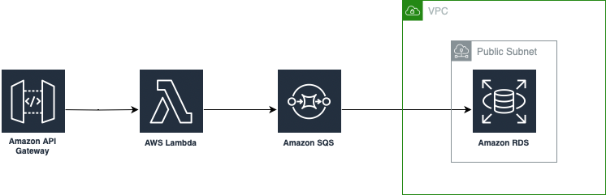

# devsecops-sre-challenge
Este repositorio contiene todos los archivos y análisis correspondiente a la solución del Challenge DevSecOps/SRE diseñado por LATAM Airlines.

## Contexto
Se requiere un sistema para ingestar y almacenar datos en una DB con la finalidad de hacer analítica avanzada. Posteriormente, los datos almacenados deben ser expuestos mediante una API HTTP para que puedan ser consumidos por terceros.

La solución propuesta en este repositorio será enfocada en el uso de servicios de AWS como Cloud provider.

## Parte 1:Infraestructura e IaC

### 1. Infraestructura necesaria para ingestar, almacenar y exponer datos

1. Base de datos: RDS Postgres es suficiente en este caso para poder crear la base de datos, en el código adjunto se escoge una instancia de tipo `micro` con el fin de reducir los costos al mínimo para esta prueba de concepto.

1. Esquema PubSub utilizando Kafka: MKS o una alternativa self-managed son las maneras seleccionadas en esta propuesta, aunque no se implementó en esta solución, el esquema de PubSub es útil en distintos escenarios en los que existan múltiples servicios (o microservicios) involucrados en el procesamiento de solicitudes de forma ordenada.

1. API Gateway - Lambda (Python): para cumplir el objetivo inicial de este ejercicio, se propone utilizar una arquitectura de API gateway mediante la cual es posible enviar una solicitud HTTP recibida y manejada inicialmente por AWS, proveedor el cual posteriormente realizará el trigger de una función Lambda (código ejecutado de forma serverless), en el cual se desarrolle la lógica de interacción con la base de datos. Este código no se implementó en esta propuesta, pero una investigación inicial dio paso a encontrar aproximaciones que pueden servir como guía para desarrollar esta etapa en un futuro, aunque en este caso la base de datos en el ejemplo es MySQL, y no Postgres: (Tutorial: Using a Lambda function to access an Amazon RDS database)[https://docs.aws.amazon.com/AmazonRDS/latest/UserGuide/rds-lambda-tutorial.html#vpc-rds-create-deployment-package]

### 2. Terraform IaC

Se implementó el código de Terraform encargado de la creación de una base de datos en RDS de tipo Postgres, disponible en una subred pública, de modo que, teniendo acceso al endpoint, y un usuario de la base de datos sea posible conectarse a la misma mediante herramientas como `psql`.

## Parte 2: Aplicaciones y flujo CI/CD

Para el despliegue de la aplicación en AWS, se propone utilizar Terraform Cloud, tanto el API Gateway como la función Lambda son implementables mediante Terraform. Terraform Cloud facilita la conexión entre operaciones de Git y `terraform apply` de forma automática, ya sea a través de Pull Requests o Push directos a la rama.

## Parte 3: Pruebas de Integración y Puntos Críticos de Calidad

Se propone una implementación de unas pruebas de integración que corran una solicitud HTTP dummy a un record específico de la base de datos en una tabla para la cual el runner tendría mínimos permisos. Esto permitiría verificar que la totalidad de la aplicación está funcionando correctamente en caso de retornar los contenidos indicados adecuadamente.

## Parte 4: Métricas y Monitoreo

Se proponen las siguientes métricas: latencia, tiempo de respuesta de lectura y tiempo de respuesta de escritura en la base de datos. Este monitoreo se implementaría en una herramienta como Grafana, permite ser configurada para la obtención de CloudWatch Metrics que describen el estado de la aplicación y simplificar su disponibilidad. También es posible crear CloudWatch Dashboards como un primer acercamiento, pero es preferible una herramienta como Grafana. En caso de abordar un problema de escalabilidad, es necesario diseñar dashboards que permitan resumir toda la información relevante de forma simple, pero destacando particularmente sistemas outliers que se puedan encontrar en estado crítico.

